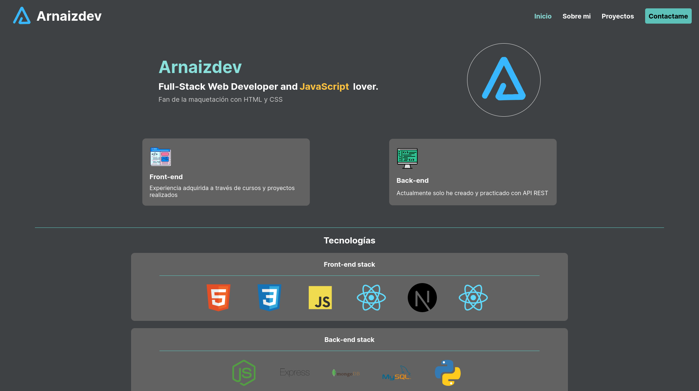

# Arnaizdev Portfolio

How the name say, this is my personal portfolio where I describe personal information from me, the languages/technologies what I know and the projects that I created.

## Languages / Technologies

### Frontend

### Others

## Description

In this project, I used NextJS because this is the language that I prefer since it use React and also is the best option for create a good project with this library. I need the SEO tools and I take advantage of this project for practice and learn NextJS.

## Future features

- Header sticky with blur background.
- Button up.
- Maybe update the technologies style

## Preview

## License

MIT License.

You can create your own portfolio by forking this project with this conditions:

- Add a link to [my portfolio](https://arnaizdev.com)

Check out [License](./License.md) for more detail.
